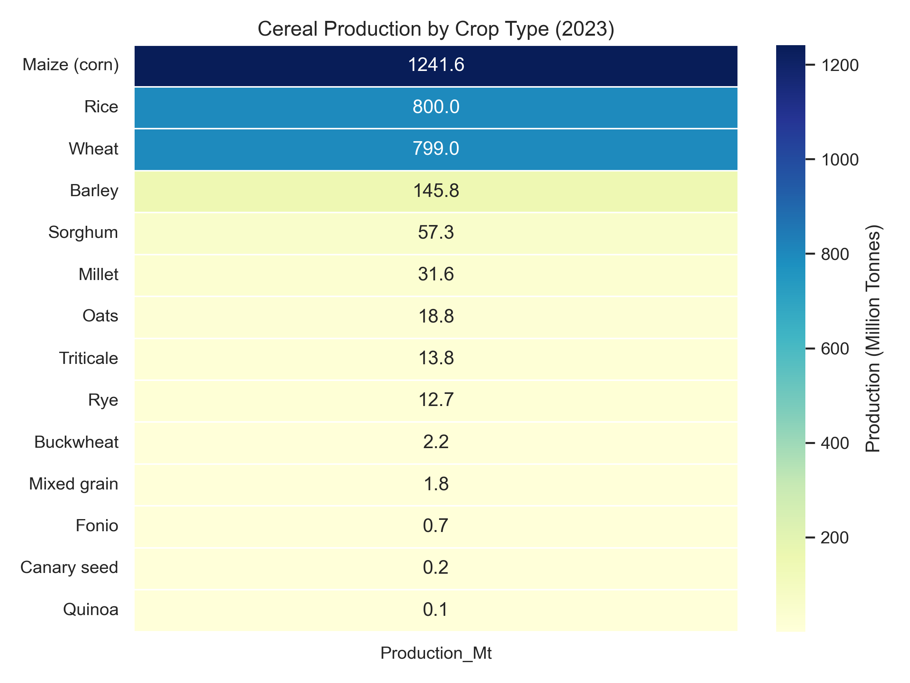
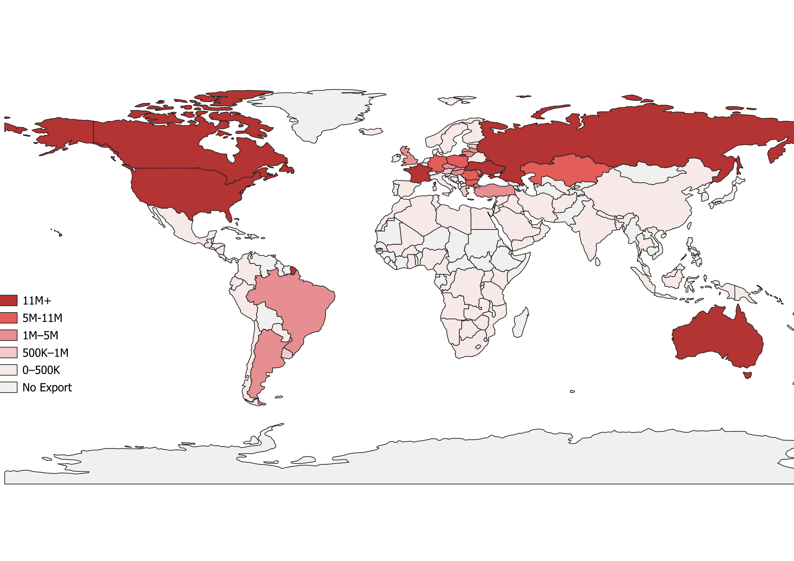
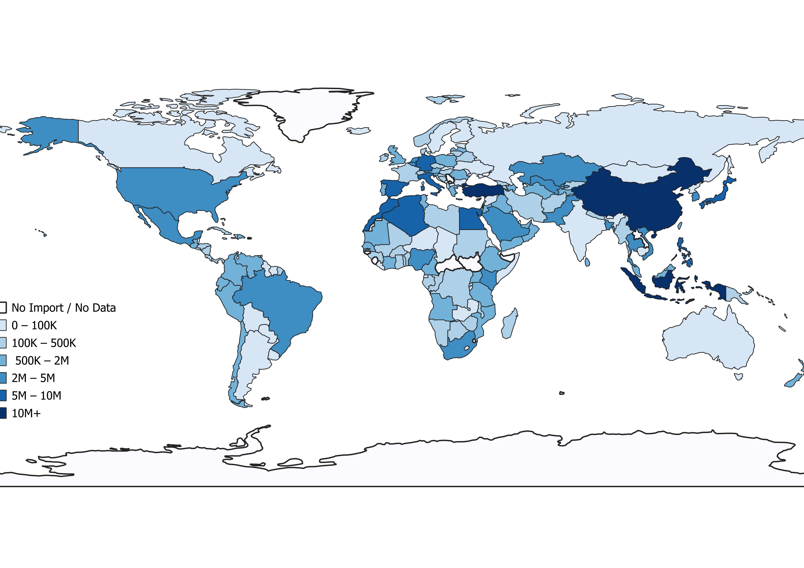
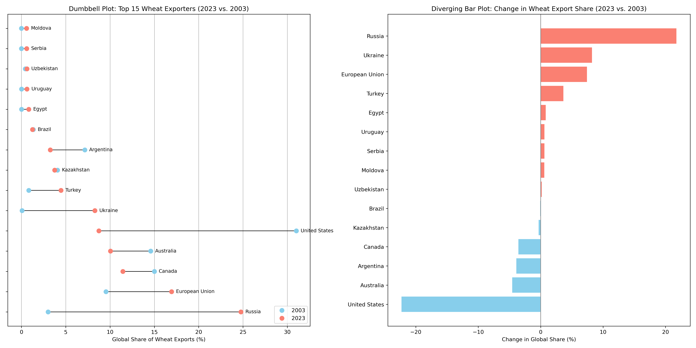
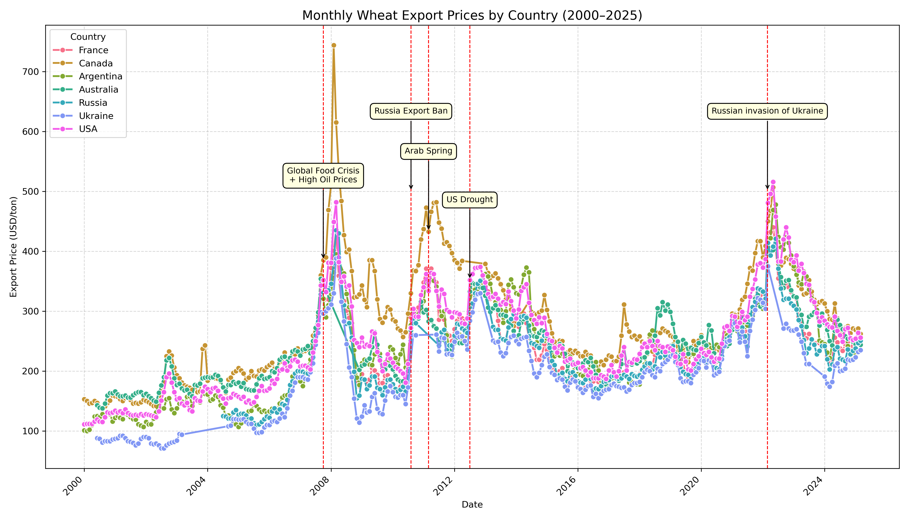
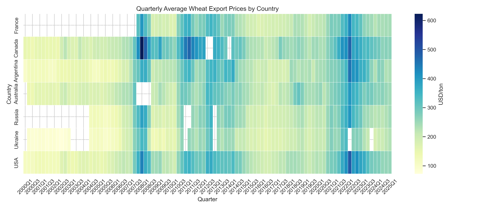
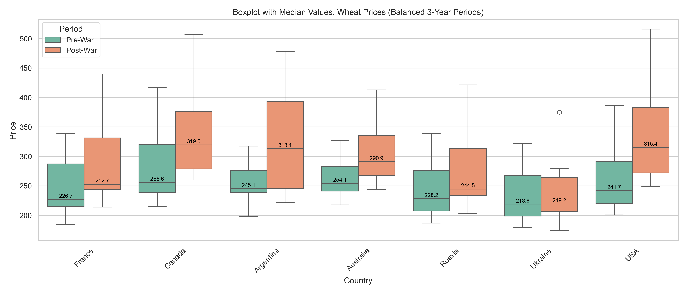
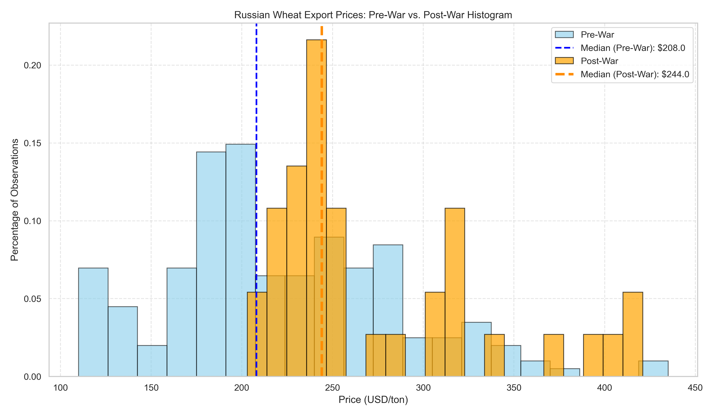

# Visualizing Wheat Trade and Price Trends

## Repository Overview

This repository explores global wheat trade and price dynamics over the past two decades using a combination of spatial, temporal, and statistical visualizations. It draws on export data from FAOSTAT and the USDA, monthly price data from the FAO’s FPMA Tool, and country boundary data from Natural Earth shapefiles. The analysis includes comparative maps, time series charts, heatmaps, and distribution plots to highlight shifts and the effect of global shocks on wheat export prices. All data processing and visualization were conducted in Python using Pandas, Matplotlib, and Seaborn, while QGIS was used for spatial mapping with Natural Earth shapefiles.

## Input Data Sources and Files

To offer an accessible, visual overview of how wheat export volumes and prices evolved across countries, driven by market forces and geopolitical events — and to illustrate how data processing and open-source tools can aid policy understanding.

---

1. **Cereal Production Data (Global)**
- **Source:** [FAOSTAT](https://www.fao.org/faostat/en/#data/QCL)
- **File Used:** `Area_Production.csv`
- **Use:** Visualizing 2023 production volumes by crop type

2. **Wheat Trade Data by Country (2023)**
- **Source:** [FAOSTAT-Trade Data](https://www.fao.org/faostat/en/#data/TCL)
- **File Used:** `Trade.csv`
- **Use:** Filtering for wheat-specific import/export quantities
- **Cleaned Output:** `merged_trade.csv`

3. **Country Boundaries (for Mapping))**
- **Source:** [Natural Earth](https://www.naturalearthdata.com/downloads/)
- **File Used:** `ne_110m_admin_0_countries (1).zip`
- **Use:** Geographic visualization in QGIS using harmonized country names

4. **Wheat Export Data (2003 vs. 2023)**
- **Source:** [USDA-PSD Online](https://apps.fas.usda.gov/psdonline/app/index.html#/app/advQuery)
- **File Used:** `exports_by_country.xlsx `
- **Use:** Long-term export share comparison

5. **Wheat Export Prices (Monthly, by Country)**
- **Source:** [FAO FPMA Tool](https://fpma.fao.org/giews/fpmat4/#/dashboard/tool/international)
- **File Used:** `prices.csv `
- **Use:** Price trends, volatility, heatmaps, distributional analysis

## Script Descriptions

### `production.py`

- **Purpose:** Visualizes total global cereal production by crop type in 2023.
- **Input:** `Area_Production.csv`
- **Output:** `heatmap_cereal_production_2023.png`
- **Details:** Filters production data for world-level totals, converts to million tonnes, and plots a ranked heatmap.
- **Libraries:** pandas, matplotlib, seaborn

### `trade.py`

- **Purpose:** Prepares a 2023 wheat import/export dataset for spatial analysis.
- **Input:** `Trade.csv`
- **Output:** `merged_trade.csv`
- **Details:** Filters wheat data, reshapes it, harmonizes country names to match Natural Earth shapefile, and outputs a clean CSV for QGIS mapping.
- **Libraries:** pandas

### `export_by_country.py`

- **Purpose:** Compares wheat export shares in 2003 and 2023 across countries.
- **Input:** `exports_by_country.xlsx `
- **Output:** `wheat_exports_combined_plot.png`
- **Details:** Calculates each country’s share of global wheat exports, ranks the top 15 exporters in 2023, and visualizes changes via a dumbbell plot and diverging bar chart in a side-by-side layout.
- **Libraries:** pandas, matplotlib

### `wheat_prices_annotated.py`

- **Purpose:** Plots monthly wheat export prices with key geopolitical event annotations.
- **Input:** `prices.csv  `
- **Output:** `wheat_prices_annotated.png`
- **Details:** Creates a multi-line price chart from 2000 to 2025 for each country and overlays balloon-style callouts for major global shocks such as the 2007 food crisis and 2022 invasion of Ukraine.
- **Libraries:** pandas, matplotlib, seaborn

### `prices.py`

- **Purpose:** Compares export price distributions before and after the invasion.
- **Input:** `prices.csv  `
- **Output:** `prices.png`
- **Details:** Filters a 3-year balanced window before and after February 2022, computes medians for each country, and visualizes using a boxplot.
- **Libraries:** pandas, matplotlib, seaborn

### `histogram.py`

- **Purpose:** Visualizes the distribution of Russian wheat prices pre- and post-2022 war.
- **Input:** `prices.csv` 
- **Output:** `histogram.png`
- **Details:** Creates a percentage-normalized histogram for Russia’s prices and marks median values for each period with dashed lines.
- **Libraries:** pandas, matplotlib

### `price_heatmap.py`

- **Purpose:** Creates a quarterly heatmap of wheat export prices.
- **Input:** `prices.csv` 
- **Output:** `prices_heatmap.png`
- **Details:** Aggregates monthly prices to quarterly averages and displays a color-coded heatmap for all countries, focusing on relative change intensity over time.
- **Libraries:** pandas, matplotlib, seaborn

## Generated Visualizations

**1. World Cereal Production**

This heatmap illustrates the global production volumes of major cereals in 2023. Maize leads global output with over 1.24 billion tonnes. Rice and wheat follow closely, each around 800 million tonnes — with wheat ranking third at 799 million tonnes. In contrast, crops such as rye and oats contribute far less to total cereal output. The color gradient reinforces each crop’s share, with darker tones representing higher production levels.

**2.	World Wheat Exporters/Importers**

- Wheat Exporters

The map illustrates the distribution of global wheat exports by country in 2023. Countries are categorized based on the total quantity of wheat exported, using six color-coded intervals. The darkest red indicates countries exporting over 11 million metric tons of wheat. Major exporters such as Russia, the United States, Canada, and Australia stand out as the dominant suppliers in the international wheat trade.

- Wheat Importers

This map shows the global distribution of wheat imports in 2023. Countries are classified into seven import volume brackets, ranging from less than 100,000 metric tons to over 10 million metric tons. The darkest blue areas represent the largest wheat importers, with countries like China, Indonesia, Egypt, and Türkiye among the top importers. This visualization highlights key demand centers in the global wheat market.

**3. Global Wheat Exporters Over Two Decades** 

The visualizations compare the global wheat export shares of the top 15 countries in 2023 with their positions in 2003. Russia shows the most significant rise, increasing its share from 3% to nearly 25%, becoming the world’s largest exporter. In contrast, the United States drops from 31% to under 9%, marking the steepest decline. Ukraine also gained notable ground, while traditional exporters like Australia, Argentina, and Canada lost share. The diverging plot clearly highlights these shifts, underscoring the changing dynamics of global wheat trade over the past two decades.

**4. Price Trends** 

From the early 2000s until the global food crisis in 2008, wheat prices show a relatively moderate upward trend. However, 2008 marks a dramatic price spike, reaching unprecedented levels. Following this turning point, global grain markets became increasingly sensitive to political and economic developments. The graph demonstrates that wheat export prices have moved in broadly similar patterns across major exporting countries, with market reactions largely occurring simultaneously. Most recently, Russia’s 2022 invasion of Ukraine led to a new record in global wheat prices, surpassing the 2008 peak — with the exception of Canada. This new peak may be considered a critical turning point in itself, and future price movements following this event will likely carry significant weight for global markets.

As an alternative visual representation of the price trends shown earlier in the line chart, this quarterly heatmap provides a more detailed and time-sensitive view of wheat export prices across major countries. By aggregating monthly data into three-month periods, it captures not only long-term trends but also seasonal fluctuations and sudden market shocks with greater resolution. The shifts in color intensity from one quarter to the next reveal synchronized responses among exporters, especially during key periods such as the 2008 food crisis or the 2022 Ukraine war.

This boxplot named `prices.png` illustrates the distribution of monthly wheat export prices across seven major producing countries, comparing the three-year periods before and after the outbreak of the Russia–Ukraine war (February 24, 2022). The median price for each country and period is annotated on the plot, providing a clear indication of shifts in central price levels. The visual reveals that post-war prices have generally increased across all countries, with notable jumps in Canada, Argentina, and the USA. The spread of prices (i.e., market volatility) also appears wider in the post-war period for several countries, reflecting heightened uncertainty in global wheat markets during geopolitical disruptions.

The histogram shows a noticeable shift in Russian wheat export prices following the 2022 Ukraine invasion. The post-war period is marked by higher median prices and a wider distribution, suggesting increased price volatility. The use of normalized percentages allows for direct comparison despite unequal data points across the two periods.

## Final Remarks

This study offers an initial step toward visualizing global wheat markets by combining recent data on trade, production, and prices. It draws attention to notable price surges driven by events such as geopolitical conflict and drought, and highlights shifts in leading trade actors. While this project does not claim to provide a comprehensive market model, it demonstrates what types of insights can emerge through structured, data-driven visualization. More detailed investigations—linking trade structures, climate variability, and long-term policy trends—would require broader interdisciplinary research. Still, this work aims to serve as a practical starting point for those interested in exploring global agricultural dynamics through visual tools.

## Acknowledgement

I would like to extend my sincere gratitude to Professor Peter J. Wilcoxen for his valuable guidance and support throughout this project. His thoughtful feedback and steady encouragement made a significant difference in my learning process.
I am also grateful to the Maxwell School of Citizenship and Public Affairs at Syracuse University for offering this course and creating a rich academic environment that made this work possible. 

For further information: gulerunlu81@gmail.com   

Thank you!
